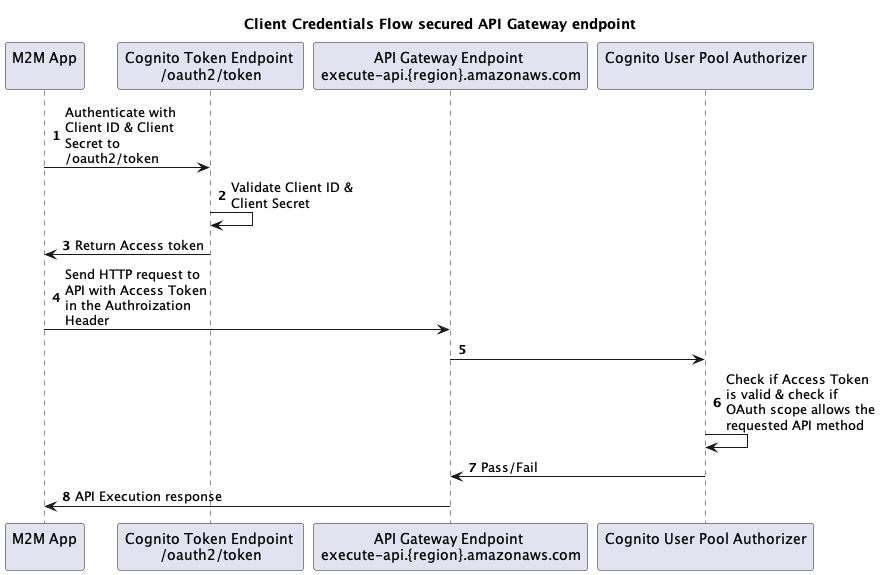

# Securing Amazon API Gateway with Cognito Authorizer and the OAuth client-credentials flow
In applications that require machine-to-machine (M2M) communications, it is common to use the Client Credentials Flow (as defined in [OAuth 2.0 RFC 6749, section 4.4](https://www.rfc-editor.org/rfc/rfc6749#section-4.4)).

This guide will explain how to implement an Amazon API Gateway which uses the Client Credential Flow for auhorization by leveraging Cognito User Pool. The sequence diagram below shows the flow for accessing an API Gateway endpoint that is using a Cognito User Pool Authorizer.

## Components
In order to achieve this it's necessary to configure the following components:
1. **Cognito User Pool** with
    - a defined resource server (API Gateway endpoint)
    - defined scopes for the resource server
    - an App Client
2. **API Gateway** 
    - with a Cognito User Pool Authorizer

# Example
The following example is based on the **PetStore API** template. This is easy to set up and will be modified so that it's secured by a Cognito User Pool Authorizer.

## Creating a REST API
Create a REST API with Amazon API Gateway (follow the instructions from the [AWS documentation](https://docs.aws.amazon.com/apigateway/latest/developerguide/api-gateway-create-api-from-example.html)). You can use the [PetStore.yaml](./src/api/PetStore.yaml) from this repository. Make note of the `API-ID` and the `Invoke URL` which will have the following syntax: `https://{restapi_id}.execute-api.{region}.amazonaws.com/{stage_name}/`

## Create a Cognito User Pool
You will need a Cognito User Pool with a defined resource server, defined scopes for that resource server and an AppClient. You can use the [cfn-cognitoResources.yaml](./src/cognito/cfn-cognitoResources.yaml) CloudFormation template. This will rollout all the necessary resources. Enter you API Invoke URL as a parameter when rolling out the CloudFormation stack. This URL will be used as a resource server within your User Pool.
Once you've successfully rolled out the CloudFormation stack, go to the Cognito console and select the User Pool that was created. Click on the **App integration** tab and scroll down to **App clients and analytics**. Click on the App client and toggle the switch **Show client secret**. Make note of both the `Client ID` and `Client secret`. 

## Create a Cognito User Pool Authorizer
Go to the PetStore API you created earlier and click on **Authorizers** and **Create New Authorizer**. Enter a **name** and set **Type** to `Cognito`. From the dropdown select the **Cognito User Pool**. Set the **Token Source** to `Authorization` as the header name which will contain the access token when invoking the API. Leave **Token Validation** empty.

## Configure the Cognito User Pool Authorizer on the API methods
1. Choose a method on your API.
2. Choose **Method Request**.
3. Under **Settings**, choose the pencil icon next to **Authorization**.
4. Choose the **Amazon Cognito user pool authorizers** you created earlier from the drop-down list.
5. To save the settings, choose the check mark icon.
6. Choose the pencil icon next to **OAuth Scopes**.
7. When you rolled out the CloudFormation Stack two scopes have been created: `read` and `write`. Type one or more full names of a scope, which will be required in the access token when requesting this API method. Use a single space to separate multiple scopes. E.g. `https://{restapi_id}.execute-api.{region}.amazonaws.com/{stage_name}/read`
At runtime, the method call succeeds if any scope that's specified on the method in this step matches a scope that's claimed in the incoming token. Otherwise, the call fails with a 401 Unauthorized response.
8. To save the setting, choose the check mark icon.
9. Repeat these steps for all other API methods that you want to secure.
10. Click on **Actions** and **Deploy** to deploy the API. Otherwise the changes you made in the previous steps will not take effect.

## Test the API with Postman
You can test the authorization of the API with Postman. You can use the [Postman Collection](./src/api/PetStore_requests.postman_collection.json) which contains some sample requests to the PetStore API.

### Import & setup API collection
1. In Postman click on **Import** and select the Postman collection JSON file.
2. Once the import is finished click on the **Variables** tab and set the environment variables which will be shared within the collection.
    - `api-id` you can obtain this ID from the Amazon API Gateway console
    - `region` the region in which your API is deployed (e.g. `eu-west-1`)
    - `stage-name` the stage name of your API (e.g. `v1`)
    - `userpool-name` this is the name of the domain in your userpool and will be used to populate the OAtuh token endpoint URL
    - `client-id` the client-id of the AppClient (can be obtained from your Cognito User Pool)
    - `client-secret` of the AppClient (can be obtained from your Cognito User Pool)
3. Save your settings.

### Generate Access Token
1. Switch to the **Generate Access Token** request in Postman.
2. Click on **Send**.
3. The response body should contain the **access_token**. Copy the value of the token.
4. (optional) You can include an explicit scope in your request. Switch to the **body** tab and go to the **x-www-form-encoded** view. Enable the **scope** key and enter the explicit scope which will be included in your access token (e.g. `https://{restapi_id}.execute-api.{region}.amazonaws.com/{stage_name}/read`). If you don't explicitly specify a scope in the request the token will include all scopes from the App Client (in this case `read` and `write`).

### Simple GET and POST request
1. Switch to the GET or POST request.
2. Under the **Authorization** tab click on the **Token** field and insert the `access_token` you received from the OAuth token endpoint in the previous section.
3. Save your settings.
4. Now you can **Send** your request.
